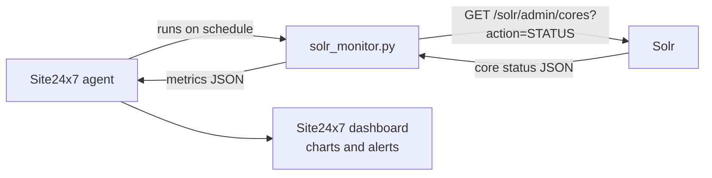

# Site24x7 Solr Plugin

A custom [Site24x7](https://www.site24x7.com/) plugin that monitors [Apache Solr](https://solr.apache.org/). Site24x7 ships with many integrations, but Solr is not one of them; this plugin fills the gap by polling Solr's cores STATUS API and reporting per-core health and document counts to your Site24x7 dashboard, where you can chart them and alert on them.

## How it works



For every core Solr reports, the plugin emits two metrics:

| Metric | Meaning |
|--------|---------|
| `<core>_doc_count` | Number of documents in the core's index |
| `<core>_status` | 1 if the core responded, part of overall plugin status |

If Solr is unreachable or returns bad data, the plugin reports `status: 0` with a failure message, which Site24x7 surfaces as a down state you can alert on. A sudden drop in a core's document count is often the earliest visible sign of an indexing problem, which makes `doc_count` a surprisingly useful alert threshold.

## Installation

Create a plugin folder inside the Site24x7 agent's plugin directory. The folder name and the script name must match for the agent to detect the plugin:

```bash
mkdir -p /opt/site24x7/monagent/plugins/solr_monitor
cp solr_monitor/solr_monitor.py /opt/site24x7/monagent/plugins/solr_monitor/
```

The agent detects the plugin automatically within a few polling cycles.

## Configuration

By default the plugin queries Solr at `http://localhost:8983`. To monitor a Solr instance elsewhere, set the `SOLR_URL` environment variable for the agent, or edit the default at the top of the script.

If you modify the script, bump `PLUGIN_VERSION` by a whole integer; Site24x7 picks up the new version automatically.

## License

MIT. See [LICENSE](LICENSE).
